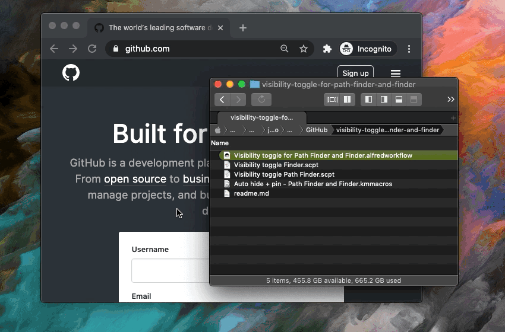

- [Why?](#why)
- [Visibility toggle for Path Finder and Finder (Alfred)](#visibility-toggle-for-path-finder-and-finder-alfred)
- [Visibility toggle for Path Finder and Finder (other 3rd party apps)](#visibility-toggle-for-path-finder-and-finder-other-3rd-party-apps)
- [Auto hide on deactivate?](#auto-hide-on-deactivate)
- [Actually... The (apple)script should work for any app](#actually-the-applescript-should-work-for-any-app)
- [General info](#general-info)

&nbsp;
____
&nbsp;



&nbsp;
____
&nbsp;

## Why?

I used to use [Total Finder](https://totalfinder.binaryage.com/) before some performance issues in Mountain Lion (I think). It attaches itself to Finder and adds new features to it, so it's not a standalone application. I used it mainly because Finder didn't yet have tabs, but it had other nice things as well. 

It had this feature that I liked a lot called [Visor](https://totalfinder.binaryage.com/visor), which basically makes the finder window act like an overlay in the sense that you can toggle Finder visibility with a shortcut and it would also hide if another window gains focus. This script brings at least part of that functionality to Finder and Path Finder.


## Visibility toggle for Path Finder and Finder (Alfred)

<button><a href="https://github.com/joonaspaakko/visibility-toggle-for-path-finder-and-finder/raw/master/Visibility%20toggle%20for%20Path%20Finder%20and%20Finder.alfredworkflow">:arrow_down: &nbsp; Visibility toggle for Path Finder and Finder.alfredworkflow</a></button>

This Alfred workflow contains one script for toggling `Path Finder` and one script for toggling `Finder`. If you use Alfred, this is the only file you need.

## Visibility toggle for Path Finder and Finder (other 3rd party apps)

If you use other apps that allow you to trigger scripts via shortcut, you can probably use the eincluded applescript files (`.script`).

<button><a href="https://github.com/joonaspaakko/visibility-toggle-for-path-finder-and-finder/raw/master/Visibility%20toggle%20Finder.scpt">:arrow_down: &nbsp; Visibility toggle Finder.scpt</a></button> <button><a href="https://github.com/joonaspaakko/visibility-toggle-for-path-finder-and-finder/raw/master/Visibility%20toggle%20Path%20Finder.scpt">:arrow_down: &nbsp; Visibility toggle Path Finder.scpt</a></button>


## Auto hide on deactivate?

If you also want the application window to auto hide on deactivate, you can use the included Keyboard Maestro macros [Auto hide + pin - Path Finder and Finder.kmmacros](https://github.com/joonaspaakko/visibility-toggle-for-path-finder-and-finder/blob/master/Auto%20hide%20%2B%20pin%20-%20Path%20Finder%20and%20Finder.kmmacros). You'll probably have to download this file with the whole repo to avoid issues.

____


## Actually... The (apple)script should work for any app

Here's a script (applescript) that toggles the visiblity of Chrome. The two `.script` files in the repo are exactly like this one, except of course they open Finder or Path Finder.

```AppleScript
set myapp to "Google Chrome"
set appOpen to false

tell application "System Events"
	
	if not (exists process myapp) then
		set appOpen to true
	else if frontmost of process myapp then
		set visible of process myapp to false
	else
		set frontmost of process myapp to true
	end if
	
end tell

if appOpen then
	tell application myapp to activate
end if
```

## General info

- The toggle scripts open the application if it's not already open.
- The application window won't auto hide on deactivate without using the [Keyboard Maestro macros](#auto-hide-on-deactivate). It will of course hide under other windows and truly hide if you use the toggle shortcut.
- I use `Cmd + Shift + >` as my hide toggle shortcut (In my Finnish/Swedish keyboard the `>` is the next button to the right from the left shift) 
- I use `Cmd + Shift + Ctrl + >` to disable/enable auto hide. Honestly I use autohide pretty rarely these days.
